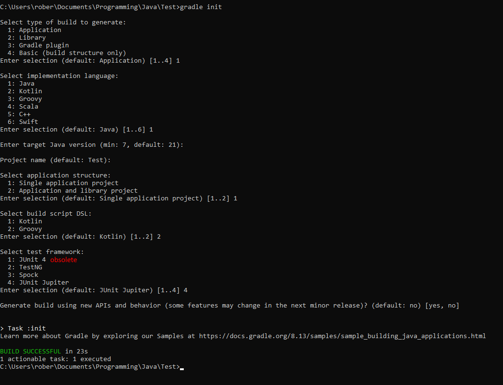

## Maven

Maven is a XML based build tool used for Java projects
Inside the `pom.xml` file you will find dependencies and build steps defined. What it defines:

- Defines folder structure
- Defines output artifact
- Defines dependencies (versions, scopes, repositories)
- Can contain modules (hierarchy)
- Plugins
- Goals. Those may be:
  - Build a jar file
  - Execute tests
  - Generate documentation
  - Push JAR to a repository

## Gradle

Open-source build-automation system that builds upon Apache's Ant and Maven. Introduces domain-specific language (DSL) groovy that is used for specified Gradle concerns. Also uses Maven repository for it's dependencies.

- `build.gradle` - gradle files are groovy language script and it means you can program your build processes by automation
- Defines a folder structure 
- Can contain multiple projects
- Defines outcomes in various formats (jar, tar, zip)
- Defines dependencies (versions, scopes, repositories)
- Plugins
- Tasks
- Custom builds, flexibility, better for larger projects

To generate a Gradle project enter `gradle init` in a CMD. For a simple .

Useful gradle commands:

- `gradle tasks`: from this we see what can of commands we can run
- `gradle run`: to run the application
- `gradle test`: to run tests

When a project with gradle is generated it generates gradle binaries it means you don't have to have gradle installed to use project as it will have the gradle.

To use binaries instead of writing `gradle` reference the binary file `gradlew`. There are two binaries - one for windows (`gradlew.bat`) and the other for mac and linux (`gradlew`).
