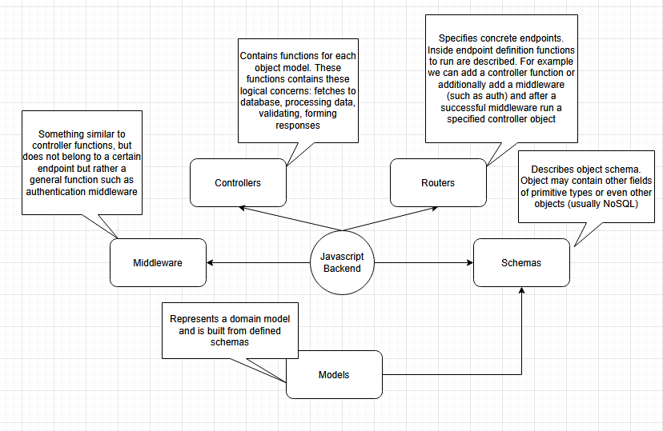

What is Spring, Spring Framework and Spring Boot

**Spring** is the brand

**Spring Framework** is a base framework that abstracts a lot of layers for creating a backend microservice application, it handles HTTP protocol implementation.

**Spring boot** is a collection of different Spring based applications that provide many different additions, like MVC, Kafka integration, Logger integrations and many many other things.

## REST APIs in Spring

An REST API is implemented in a three layers application pattern and it contains (as an example checkout the , also this [rail architecture](https://github.com/rails/rails), they use varied verbatim but describe similar concepts):

- Controller: specifies concrete endpoints. Responsible for communication with clients.  
> *Also it says contains logic for responses, but it seems it's a nice segmentation to have them inside service functions, same as in javascript, but adhering to separation of concerns it makes more sense to make service more functional-paradigm-like and not have them handle response but only data processing and informing about the results*
- Service: business logic. Defines how system works
- Repository: data access logic.

So all files are structured in the way to facilitate this pattern 

Spring is modular by design. Some the main parts of spring are:

- Core Container: Beans, Core, Context, SpEL
- AOP, Aspects, Instrumentation, Messaging
- For data access/integration: JDBC, ORM, OXM, JMS, Transactions
- Web: WebSocket, Servlet, Web, Portlet

Projects, Modules:
- Boot
- MVC
- DI (dependency injection)
- Data access (Transactions)
- Security

Core features:

Coupling - the degree to which a module, class or other construct is directly tied to others

Less coupling means the system is easier to maintain

**SOLI(Dependency inversion)** - depend on abstractions, rather than implementations

## IoC

If we have a service, a piece of functionality to be used in other places it should be used as an abstraction. We know what functionality the services provides, but we don't know it's implementation. Our consumption of the service should not care for it's dependencies.

Inversion of control - is a design principle, where **custom-written portions of o a computer program** receive **flow of control** from an external source (e.g. framework) 

Component - a glob of code to be used without change when writing an application that is out of control of the component writers. Without change means that the application does not change source code of the component, it may only configure it in certain ways.

Service - is similar to component. Main difference is that component is meant to be used locally - it's a jar file, assembly, dll. A service will be used remotely through some interface, either synchronous or async (web service, messaging system, RPC, APIs?).

```java
class MovieLister...

  public Movie[] moviesDirectedBy(String arg) {
      List allMovies = finder.findAll();
      for (Iterator it = allMovies.iterator(); it.hasNext();) {
          Movie movie = (Movie) it.next();
          if (!movie.getDirector().equals(arg)) it.remove();
      }
      return (Movie[]) allMovies.toArray(new Movie[allMovies.size()]);
  }
```

The point is the `finder` object, more precisely how we connect the lister object with a particular finder object. Another constraint is that the method moviesDirectedBy has to be completely independent of how all the movies are being stored. All the method does is refer to a finder and all the finder knows is how to respond to `findAll` call.

```java
public interface MovieFinder {
  List findAll();
}
```

```java
class MovieLister...

  private MovieFinder finder;
  public MovieLister() {
    finder = new ColonDelimitedMovieFinder("movies1.txt");
  }
```

Now let's say we have a problem. Our friend wants to use the MovieLister class. But now there is a problem what if they have a completely different form of storing their movie listing: a SQL database, an XML file, a web service, or just another format of text file? Since we have MovieFinder interface implemented we need to find a way to get an instance of the right finder implementation.

As you can see MovieLister now depends on MovieFinder and it's implementation ColonDelimitedMovieFinder. We would prefer it if it were only dependent on the interface, but then how do we make an instance to work with?

Plugin - links classes during configuration rather than compilation. The implementation class for the finder isn't linked to the program at compile time as we don't know what our friends might use. Instead we want lister to work with any implementation, and for that implementation to be **plugged** in at some point, out of my hands. How can we make that link so that the lister class is ignorant of the implementation class, but can still talk to an instance to do the needed work.

So the core problem is how do we assemble these plugins into an application? and universally they all do it using **Inversion of Control**.

Inversion of control - the standard way of program is that it asks me to input name, the inversion would be that I input it somewhere and some event happens

## Beans

Everything in Spring is a Bean. All services and components are Beans. Beans is a fundamental part of Spring. Beans are objects that are kept in the IoC container, so they are instances of classes and they implement some kind of business logic.

We can configure Bean metadata. We can make Bean reference some Java service, a name, it's scope, once the Bean is defined it is free to use in the application context. 

Creating Beans:

- Add Spring annotations to Java classes (`@Controller`, `@RestController`, `@Service`, `@Repository`, `@Component`) 

We can use Beans inside of Beans. When we create Beans we annotate and implement constructors with dependents all the rest is managed by Spring.

FatJar is having all dependencies compressed into one jar file

## Scopes

Scopes control how IoC container manages Beans in different places of the application

## Singleton scope

Only one shared instance of a singleton bean is managed, and all requests for beans with an id or ids matching that bean definition result in one specific beans instance being returned by Spring container  

As a rule of thumb, use Singleton scope for stateless beans

`@Service`

## Prototype scope

Bean with prototype scope results in the creation of a new bean instance every time a request for that specific bean is made. That is, the bean injected into another bean or you request it through a getBean() method call on the container

@Component
@Scope(ConfigurableBeanFactory.SCOPE_PROTOTYPE)  

## More scopes

Request - this scope is when bean instance live the lifetime of http request on server (on the same thread, to be precise)

Session - used for keeping session state

## Logbok

Provides helper annotations to reduce boilerplate

- `@Builder` lets you automatically produce the code required to have your class be instantiable with code such as: 
```java

    Person.builder()
    .name("Adam Savage")
    .city("San Francisco")
    .job("Mythbusters")
    .job("Unchained Reaction")
    .build();
```
Builders are a way to create class instances?

- `@Data`: @Data is a convenient shortcut annotation that bundles the features of @ToString, @EqualsAndHashCode, @Getter / @Setter and @RequiredArgsConstructor together: In other words, @Data generates all the boilerplate that is normally associated with simple POJOs (Plain Old Java Objects) and beans: getters for all fields, setters for all non-final fields, and appropriate toString, equals and hashCode implementations that involve the fields of the class, and a constructor that initializes all final fields, as well as all non-final fields with no initializer that have been marked with @NonNull, in order to ensure the field is never null. 

## DTO

Data transfer objects are objects are used to communicate between systems. DTO classes describe the shape (properties of the said DTO)

## Basic spring layers relationships

**Controller** defines APIs and calls the **Service** for how to get data. **DTOs** are for defining the return types or just how to pass some values around.

Services call repositories to get data from databases

## Spring configuration

Is useful when overriding a third-party class

```java
@Configuration
public class AppConfiguration {
  @Bean
  public ObjectMapper objectMapper() {
    ObjectMapper mapper = new ObjectMapper();
    mapper.registerModule(new JavaTimeModule());
    mapper.configure(DeserializationModule(FAIL_ON_UNKNOWN_PROPERTIES, true));
    return mapper;
  }
}
```

## Properties

Externalize configuration properties. They are used to set up application for working in different environments. Usually property files, YAML files, env variables, and command-line arguments are used for configuring.

Properties are considered in the following order:
- Command line arguments
- Java System Properties (System.getProperties())
- OS environment properties
- Application properties outside of the packaged JAR (application.properties and YAM variants)
- Application properties packaged inside your application jar (application.properties and YAML variants)

Property values are injected with `@Value` and by referencing their identifier

## Exceptions

Exceptions are events in your code that indicate that something has gone not according to plan. Exception types:

- Checked: are runtime errors
- Unchecked: those that happen out of your control

For unchecked we can create handlers. We annotate classes with `@ControllerAdvice` this tells Spring how we would like to handle some exceptions and behavior

```java
@ControllerAdvice
public class FeedbackAppErrorHandler {
  @ExceptionHandler(Exception.class)
  @ResponseBody
  public ErrorDto manageException(HttpServletResponse response, Exception ex) {
    response.setStatus(HttpServletResponse.SC_INTERNAL_SERVER_ERROR);
    log.error("Generic exception handler caught unhandled error", ex);
    return ErrorDto.builder()
      .message("unknown problem occurred, please contact support")
      .timestamp(OffsetDateTime.now())
      .build();
  }
}
```

If we did not have this, Spring would respond with a generic spring response of "Internal server error"

## Validation

- *Fail as fast as possible* when provided with incorrect input
- Define rules for what data is acceptable and what is not
- No need to do that in every method - only for boundaries
- In case of RESTApis, appropriate boundary is the controller

Bean validations comes with a lot of out-of-the box validators:
@NotEmpty, @NotBlank, @Length(min=1, max=10), @Email, etc.

### Custom Bean validations

Custom annotation class is used for parametrizing the validation

Actual validation logic is implemented in a custom validation class

Defines validation parameters and specifies used validator:

```java
@Constraint(validatedBy = {QuizIdValidator.class}) // specifies validator class 
@Target({ElementType.FIELD, ElementType.PARAMETER}) // defines that this annotation will be applied to a field or a parameter of a method
@Retention(value = retentionPolicy.RUNTIME)
public @interface QuizId {
  String message() default "Non-existing quiz ID";
  Class<?>[] groups() default {};
  Class<? extends Payload[]> payload() default {};
}
```

```java
@Component
public class QuizIdValidator implements ConstraintValidator<QuizId, UUID> {
  @Autowired
  QuizRepository quizRepository;

  @Override
  public boolean isValid(UUID quizId, ConstraintValidatorContext context) {
    return !quizRepository.getById(quizId).isEmpty();
  }

  @Override
  public void initialize(QuizId constraintAnnotation) {
    ConstraintValidator.super.initialize(constraintAnnotation);
  }
}
```

## Groups

Sometimes same object needs to be validated using different rules depending on the situation

```java
public class Quiz {
  private Long id;

  @NotBlank(groups = BasicInfo.class)
  private String code;

  @NotBlank(groups = AdvancedInfo.class)
  private String title;
}
```

```java
@PostMapping("/quiz")
public ResponseEntity<Quiz> saveQuiz(@RequestBody @Validated(AdvancedInfo.class) Quiz quiz) {
  return ResponseEntity.ok(quizService.addQuiz(quiz));
}

@PostMapping("/quiz")
public ResponseEntity<Quiz> saveQuiz(@RequestBody @Validated(BasicInfo.class) Quiz quiz) {
  return ResponseEntity.ok(quizService.addQuiz(quiz));
}
```

## Controller parameter validation

Controller has to be annotated with `@Validated` and also the parameter then following that add various validation annotations

```java
@RestController
@Validated
public class QuizController {
  @GetMapping("/searchByTitle")
  public ResponseEntity<Quiz> getQuiz(@Validated @NotNull @Length(min=3)
  @RequestParam("phrase") String phrase) {
    return quizService.getByTitle(phrase);
  }
}
```

So these validators allows us to implement any validation logic we want. In this case a repository method is called to check if a record with a specified ID exists in the database. Generally it is not a good practice and it would be considered having business logic inside of a validator, but having such validations outside of Service logic is beneficial in the long run as it allows reusability and encapsulate validation logic. 

IoC - inversion of control container. Is a tool that helps to streamline the configuration and management of Java objects.

IoC uses dependency injection or dependency injection patterns to provide objects reference during run time.

AOP - aspect oriented programming - increases modularity by separating cross cutting concerns to functions that span across the application. It does so by adding behavior to existing code (an advice) without modifying the code, instead separately specifying which code is modified via a "pointcut" specification, such as "log all function calls when the function's name begins with 'set'". This allows behaviors that are not central to the business logic (such as logging) to be added to a program without cluttering the code of core functions. 

DAF - data access framework