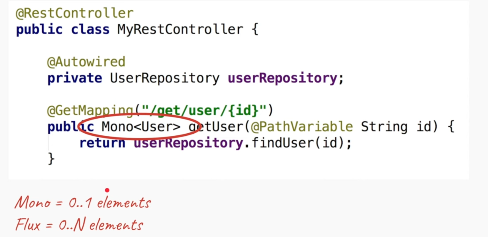

Courtesy of [Defog tech](https://www.youtube.com/watch?v=M3jNn3HMeWg)

The problem:

Imagine we have incoming requests. For each request a new thread is created. Now imagine there are some asynchronous parts for our request, e.g. database fetches. The thread that is handling the request will be waiting and doing nothing while fetching data, so while new requests come, new threads will be created to service requests. As most services have thread caps, we might cap out our thread pool on high traffic scenarios.

This inefficiency can be remedied using reactive design pattern. Instead of waiting we could ask the database to call some operation once the data arrives so I don't have to wait. And now the same thread can serve other requests and if it's processing when a response arrives, the same thread or any other available  can handle the response from database. And with this method we achieve non-blocking behavior. 

So the architecture of the service is something like this:
We still have our limited pool of threads that serve the requests coming from users. When a request comes a thread is assigned and it does some necessary processing. When times come to do some blocking operations we would delegate any other operations to the appropriate handlers, in this case it might be a DB driver which will fire an event to inform that it has returned data and the assigned operation would get performed.

- No thread switches. With previously described scenario JVM would a lot of thread switching as it would have to handle new requests with different non-blocked threads.
- More efficient use of CPU
- More concurrent requests
- Increased complexity. Less number of threads. More scalability

Webflux achieves this with:
- Servlets 3.0 and 3.1 (Async and NIO) 
- Java NIO (File Network, IO)
- MongoDB, Cassandra, Redis

It's important to note, everything in the request has to be non-blocking.

