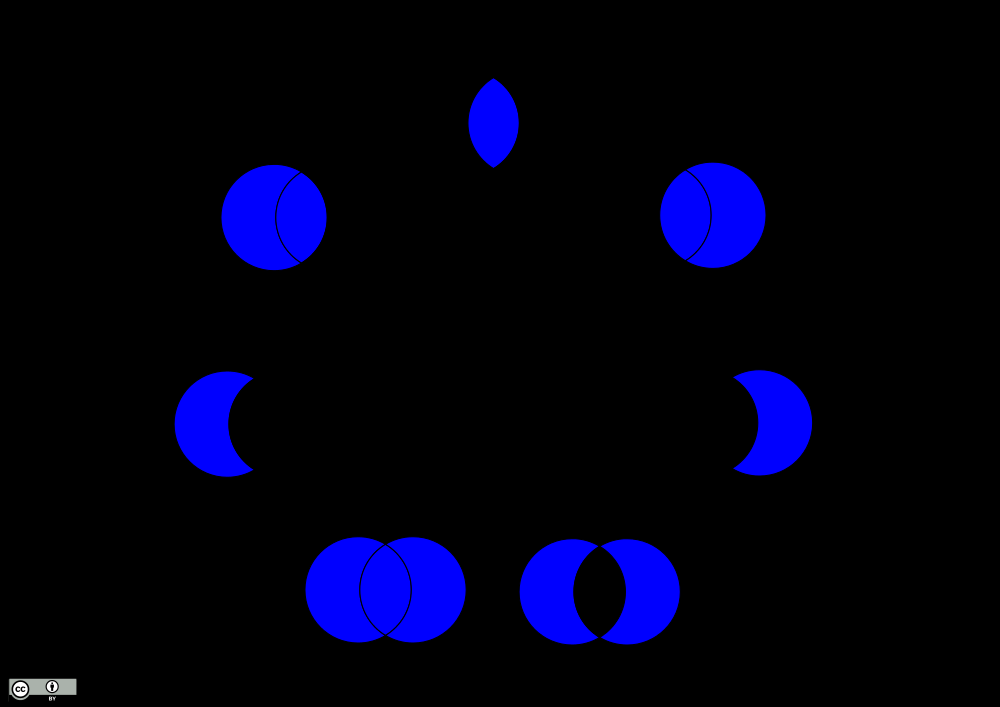

## INNER JOIN

Gives what exists in table A and table B

```sql
SELECT recipes.title, recipes.body, recipes_photos.url 
  FROM recipes_phots 
  INNER JOIN recipes 
  ON 
    recipes_phots.recipe_id = recipes.recipes.id
```

Let's say our recipes_photos table did not have a photo for a certain recipe but there is a need for a default photo

```sql
SELECT r.title, rp.url 
  FROM recipes_photos rp 
  RIGHT OUTER JOIN recipes r 
  ON r.recipe_id = rp.recipe_id;
```



Example: 

```sql
SELECT * FROM recipes_photos rp LEFT JOIN recipes r ON rp.recipe_id = r.recipe_id WHERE r.recipe_id IS NULL;
```

Will get all the recipes like with inner join but also it will get urls that do not have recipes

But it is also possible to get only empty records, in this case only photos without recipes

```sql
SELECT * FROM recipes_photos rp LEFT JOIN recipes r ON rp.recipe_id = r.recipe_id WHERE r.recipe_id IS NULL
```

As you can see, because the records without the images have recipe_id null, it will filter out all the retrieved rows with recipes references so only image rows remain.

## Natural join

```sql
SELECT * FROM recipes NATURAL JOIN recipes_photos
```

This will perform an INNER join. Because there's a column called recipe_id on both tables SQL has a shorthand for performing a join. You can also perform NATURAL LEFT JOIN and NATURAL RIGHT JOIN. But it is suggested to avoid this.

## CROSS JOIN 

Creates every possible permutation with every row of specified tables.

Let's say you had a table with a dog, cat, bird and another table for storing colors - red, green, blue with cross join you would retrieve
red dog, red cat, red bird, green dog, green cat and so on.

```sql
SELECT r.title, r.body, rp.url FROM recipes_photos rp CROSS JOIN recipes r;
```