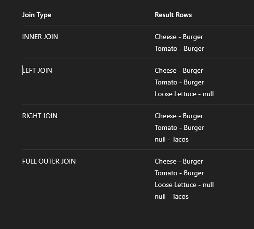

## INNER JOIN

Gives what exists in table A and table B

```sql
SELECT recipes.title, recipes.body, recipes_photos.url 
  FROM recipes_phots 
  INNER JOIN recipes 
  ON 
    recipes_phots.recipe_id = recipes.recipes.id
```

Let's say our recipes_photos table did not have a photo for a certain recipe but there is a need for a default photo

```sql
SELECT r.title, rp.url 
  FROM recipes_photos rp 
  RIGHT OUTER JOIN recipes r 
  ON r.recipe_id = rp.recipe_id;
```


Example: 

```sql
SELECT * FROM recipes_photos rp LEFT JOIN recipes r ON rp.recipe_id = r.recipe_id WHERE r.recipe_id IS NULL;
```

Will get all the recipes like with inner join but also it will get urls that do not have recipes

But it is also possible to get only empty records, in this case only photos without recipes

```sql
SELECT * FROM recipes_photos rp LEFT JOIN recipes r ON rp.recipe_id = r.recipe_id WHERE r.recipe_id IS NULL
```

As you can see, because the records without the images have recipe_id null, it will filter out all the retrieved rows with recipes references so only image rows remain.

## Natural join

```sql
SELECT * FROM recipes NATURAL JOIN recipes_photos
```

This will perform an INNER join. Because there's a column called recipe_id on both tables SQL has a shorthand for performing a join. You can also perform NATURAL LEFT JOIN and NATURAL RIGHT JOIN. But it is suggested to avoid this.

## CROSS JOIN 

Creates every possible permutation with every row of specified tables.

Let's say you had a table with a dog, cat, bird and another table for storing colors - red, green, blue with cross join you would retrieve
red dog, red cat, red bird, green dog, green cat and so on.

```sql
SELECT r.title, r.body, rp.url FROM recipes_photos rp CROSS JOIN recipes r;
```



A JOIN clause is used in SQL to combine records from two or more tables in a database, using a related column (usually a foreign key).

## Types of Joins

1. INNER JOIN

    Returns only the rows with matching values in both tables.

    Most commonly used join.

```sql
SELECT *
FROM orders
INNER JOIN customers
ON orders.customer_id = customers.id;
```

Only customers who placed orders will appear.

2. LEFT JOIN (or LEFT OUTER JOIN)

    Returns all rows from the left table, and the matched rows from the right table.

    If no match, returns NULL for right table's columns.

```sql
SELECT *
FROM customers
LEFT JOIN orders
ON customers.id = orders.customer_id;
```

All customers, even those without orders.

3. RIGHT JOIN (or RIGHT OUTER JOIN)

    Returns all rows from the right table, and the matched rows from the left table.

```sql
SELECT *
FROM orders
RIGHT JOIN customers
ON orders.customer_id = customers.id;
```
➡️ All orders, showing customer data where available.
4. FULL JOIN (or FULL OUTER JOIN)

    Returns all rows from both tables.

    Rows without a match in either table get NULL for the missing side.

```sql
SELECT *
FROM customers
FULL OUTER JOIN orders
ON customers.id = orders.customer_id;
```

➡️ All customers and all orders, with matches shown and non-matches filled with NULL.

5. CROSS JOIN

    Returns the Cartesian product of both tables.

    Every row in the first table is matched with every row in the second.

```sql
SELECT *
FROM products
CROSS JOIN colors;
```

➡️ Useful for combinations (e.g., all product-color pairs).

6. SELF JOIN

    A table joined to itself, useful for hierarchical or recursive relationships.

```sql
SELECT A.name AS Employee, B.name AS Manager
FROM employees A
LEFT JOIN employees B
ON A.manager_id = B.id;
```

➡️ Employees with their managers.

📌 Join Conditions

Joins usually use equality on keys:

ON table1.key = table2.key

But you can also use inequalities or other operators:

ON employees.salary > managers.salary

Visual Summary (Text Form)

INNER JOIN:         A ∩ B
LEFT JOIN:          A ⟕ B
RIGHT JOIN:         A ⟖ B
FULL OUTER JOIN:    A ⟗ B
CROSS JOIN:         A × B

Tips

    Always alias tables (e.g., a, b) for readability in complex joins.

    Use USING(column) instead of ON if both tables share the same column name.

    Be cautious with CROSS JOIN—it can produce huge results!

To filter records, not to get extra columns or rows, here are better options:

1. Use WHERE EXISTS

This is ideal when you want to filter rows in one table based on the existence of related rows in another table.

```sql
SELECT *
FROM customers c
WHERE EXISTS (
  SELECT 1
  FROM orders o
  WHERE o.customer_id = c.id
);
```

➡️ Returns only customers who have at least one order — no duplication, and no join output.

2. Use WHERE IN

Another option, often simpler but can be less efficient with large datasets.

```sql
SELECT *
FROM customers
WHERE id IN (
  SELECT customer_id
  FROM orders
);
```

➡️ Same logic as EXISTS, but less flexible for complex conditions.

3. Use INTERSECT (if supported)

This returns only the common rows between two queries.

```sql
SELECT id FROM customers
INTERSECT
SELECT customer_id FROM orders;
```

➡️ Less common but clean if you're just comparing sets.