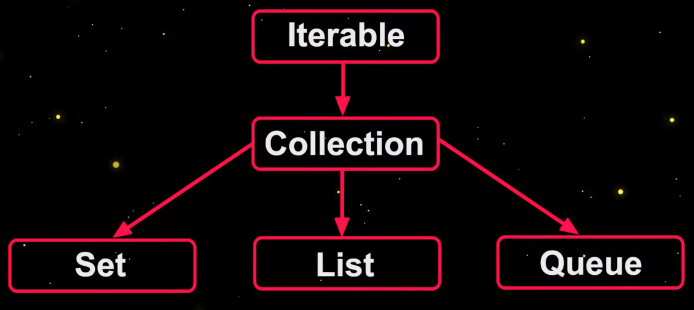
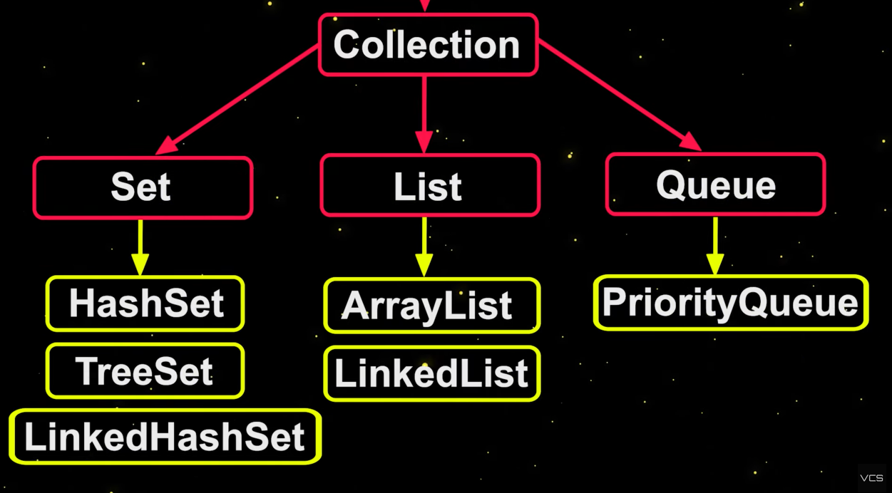

Collections framework provides implementations for widely used data structures.  

- List (ArrayList, LinkedList)
- Set (HashSet, TreeSet)
- Queue (PriorityQueue, Deque)
- Map (HashMap, TreeMap)

Due to the OOP nature of Java, these collections are implemented in a way that can be extended to suit one's needs 

Iterable is the base interface





## Set

Set is an unordered collection of unique objects

```java
public static void setDemo() {
    Set<String> fruits = new HashSet<>();
    fruits.add("Pineapple");
    fruits.add("cherry");
    System.out.println(fruits);
    Set<String> filteredFruits = fruits.stream().filter(fruit -> Character.isLowerCase(fruit.charAt(0))).collect(Collectors.toSet());
    System.out.println(filteredFruits);
    System.out.printf("Contains cherry?: %b", filteredFruits.contains("cherry"));

    filteredFruits.add("watermelon");
    filteredFruits.remove("cherry");

    //creates an immutable set
    Set<String> ingredients = Set.of("flour", "eggs", "milk");
    ingredients.add("will throw error");
}
```

## List

A list contains ordered elements accessible by position. Usually ordered as they came in and you can have duplicate ones

### ArrayList

Is a dynamic list for storing elements.

Basic operations: 
- add
- remove
- contains
- isEmpty

Characteristics:
Used for random access through indexes is needed
Memory efficient
Remove and contains O(n) so they are slower and linked list are better for that.

```java
public static void listDemo() {
    List<String> fruits = new ArrayList<>();
    fruits.add("apple");
    fruits.add("banana");
    fruits.add("orange");
    fruits.add("grape");

    System.out.println(fruits);

    fruits.set(1, "pear");
    fruits.add("apple");
    fruits.remove(1);
    System.out.println(fruits);
    fruits.remove("apple");

    System.out.println(fruits);
}
```

### LinkedList

Elements are in nodes spread in the memory and are connected

- add
- remove (with index) O(1) as  does not shift elements because they are linked
- clear

#### Inheriting Deque interface

Because LinkedList is inheriting the double ended queue it means the class provides methods for removing and adding elements from both sides.

Can be used as queue by using `offer` and `poll` (from implemented Deque class). 

Can also be used as a stack with `push` and `pop` methods

## Queue

A list of ordered elements that are processed in the order in which they are added

FIFO (Queue), LIFO (Stack)

## LinkedList as queue

As previously mentioned, LinkedList implements Deque which has all the methods needed for a queue, so it can be used as a more traditional queue or stack. 

```java
public static void listDemo() {
  Queue<String> food = new LinkedList<>();
  food.add("Banana");
  food.add("Avocado");
  food.add("Peach");
  food.add("Lemon");

  System.out.println(food);

  food.offer("Apple");
  food.offer("Orange");
  food.offer("Eggplant");

  System.out.println(food);

  food.poll();

  System.out.println(food);
}
```

For it to be more like a stack, use LinkedList as it's type.

```java
public static void listDemo() {
  Deque<String> food = new LinkedList<>();

  food.add("Banana");
  food.add("Avocado");
  food.add("Peach");
  food.add("Lemon");

  System.out.println(food);

  food.offer("Apple");
  food.offer("Orange");
  food.offer("Eggplant");

  System.out.println(food);

  food.poll();

  System.out.println(food);
  
  food.push("Cherry");
  food.push("Melon");
  food.push("Pumpkin");

  System.out.println(food);
}
```

### PriorityQueue

Provides functionality of a queue. It's main function is removal of elements based on priority. The elements are selected based on comparator. The comparator for basic types such as Integer are them being sorted in an ascending order and then the last element gets removed. But you can also specify comparators:

```java
PriorityQueue<UserProfile> usersQueue = new PriorityQueue<>(
  Comparator.comparing((UserProfile u -> u.age))
)
```

Priority queue is basically a heap data structure and it works efficiently when adding and retrieving elements O(logN).

## Maps

Maps are for storing unique unordered key-value pairs.

Does not inherit from the Collections interface. It is considered as a part of the Collection framework as a data structure for structuring your data

Keys cannot be duplicate, but the same cannot be said for values.

```java
public static void mapDemo() {
  Map<String, Integer> fruitCalories = new HashMap<>();
  fruitCalories.put("Apple", 52);
  fruitCalories.put("Cherry", 50);
  fruitCalories.putIfAbsent("Almond", 576);
  fruitCalories.putIfAbsent("Apple", 55); // will not


  System.out.println(fruitCalories);
  System.out.println(fruitCalories.get("Apple"));
  System.out.println(fruitCalories.containsKey("Cherry"));
  fruitCalories.remove("Cherry");
  System.out.println(fruitCalories.containsKey("Cherry"));

  Map immutableFruitCalories = Map.of(
          "apple", 51,
          "lemon", 20
  );
}
```

You cannot iterate over a map as the order of insertion is not preserved due to the nature of hashmaps.

LinkedHashMap uses linked list internally so it provides a way for iteration.

### TreeMap (Red-black tree)

Keeps entries sorted by key

## Complexities

Many of the computational complexities can be deduced by data structure knowledge but for a [quick reference you this site offers a great lookup](https://gist.github.com/marcinjackowiak/85f144d0f1ed5fd066d4d2a34961497c)

## Iterators 

Object used to loop through collections. It is the base interface for all collections (remember map does not inherit from iterator).

```java
public static void setDemo() {
  Set<String> fruits = new HashSet<>();
  fruits.add("Pineapple");
  fruits.add("cherry");
  System.out.println(fruits);
  Set<String> filteredFruits = fruits.stream().filter(fruit -> Character.isLowerCase(fruit.charAt(0))).collect(Collectors.toSet());
  System.out.println(filteredFruits);
  System.out.printf("Contains cherry?: %b", filteredFruits.contains("cherry"));

  filteredFruits.add("watermelon");
  filteredFruits.remove("cherry");

  //creates an immutable set
  Set<String> ingredients = Set.of("flour", "eggs", "milk");
  ingredients.add("will throw error");

  var i = fruits.iterator();

  while (i.hasNext()) {
      System.out.println(i.next());
  }
  //syntax sugar
  for (String fruit : fruits) {
      System.out.println(fruit);
  }
}
```

We can turn map ot a collection with entrySet:

```java
public static void mapDemo() {
  Map<String, Integer> fruitCalories = new HashMap<>();
  fruitCalories.put("Apple", 52);
  fruitCalories.put("Cherry", 50);
  fruitCalories.putIfAbsent("Almond", 576);
  fruitCalories.putIfAbsent("Apple", 55); // will not


  System.out.println(fruitCalories);
  System.out.println(fruitCalories.get("Apple"));
  System.out.println(fruitCalories.containsKey("Cherry"));
  fruitCalories.remove("Cherry");
  System.out.println(fruitCalories.containsKey("Cherry"));

  Map immutableFruitCalories = Map.of(
          "apple", 51,
          "lemon", 20
  );

  Set mapEntries = fruitCalories.entryMap();
  var i = mapEntries.iterator();
  while(i.hasNext()) {
    Map.Entry entry = (Map.Entry)i.next();
    System.out.println(entry.getKey());
    System.out.println(entry.getValue());
  }
}
```

A better alternative is to use `forEach` as it is even available on map. 

We could also pass in function references into forEach and stream functions where they accept lambda expressions.

```java

public class CollectionsDemo {

  public static void doubleInt(int x) {
    System.out.println(x * 2);
  }

  public static void forEachDemo() {
    List<Integer> numberList = new ArrayList<>();
    numberList.add(1);
    numberList.add(2);
    numberList.add(3);
    numberList.add(4);

    numberList.forEach(CollectionsDemo::doubleInt);
  }
}
```