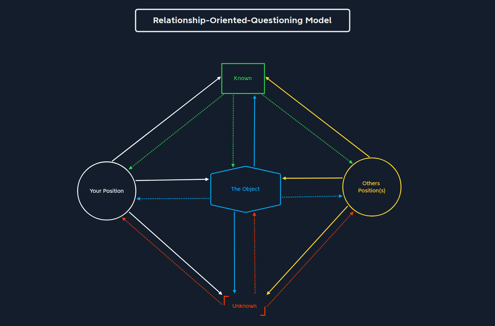

# The process of achieving Mastery
This document will contain just general knowledge about programming, the process of learning, how to approach problems and etc.

## Programming
You do not have to know every single programming language, but what you should do is to develop a deep understanding of software engineering.

R. D. Tennent has defined these principles that define all programming languages:
1. The Principle of Abstraction
2. The Principle of Correspondence
3. The Principle of Data Type Completeness

How would you solve this math problem?:
20 * _____ + _____ = 65535

After solving the problem, ask yourself: how many different ways is there of solving this problem and why did you choose the way chose?

```
I solved the problem by realizing that you can multiply the 20 by any number that would not make the sum bigger than the answer and then just adding the remainder of answer - multiplication operation. Before choosing this way I was a little bit confused about how would I choose the correct numbers, but then I realized that I can choose a lot of different number combinations and made that my answer to the math problem.
```

But the problem has no limitations, we could've added more arithmetic operations, add more digits, replace the given, and that is - `Thinking outside the box`

So why did we not think to do that?

```
I think because I saw the two blanks and automatically though that I had to insert two numbers, when in reality I could've inserted anything I wanted that would've helped me to solve the problem. The problem with my current way of think is not including more possibilities, not thinking of more potential ways of solving problems. I understand that I can test many different scenarios to see if I get a desired outcome, but I rarely generate different scenarios that could lead me to getting desired results.  
```

Thinking outside the box let's us cross the imaginary boundaries thus letting us access possibilities and options that were not recognized by us before.

Occam's Razor is a central principle of modern scientific theory. The principle is based on the following definition:
`The most straightforward theory is preferable to all others of several sufficient possible explanations for the same state of facts. In other words: the simplest explanation is always the most probable`

## Talent
How many people can naturally fly an airplane?
Without any prior knowledge I think almost nobody can fly an airplane. But a person who has studied controlling airplanes, physics and such, could make the airplane take off, but still, actually applying the knowledge is crucial too. So constant or persistent confrontation with problems and being in the process of solving them helps us improve and become that TALENTED person we are jealous of. Because as we solve more and more problems our understanding expands and our tool repertoire.

Of course, it's important to consider that learning to play a guitar for someone who has never played a guitar will be considerably more difficult than for someone who knows how to play other string instruments. Of course, it's also worth comparing not only a guitarist versus a person who does not know music, we can compare a person without prior music knowledge to a any musician. We know that a musician will have some knowledge of how music works and will be learning entirely different skills than a person who has never worked with music in their life. So if doing comparing it's important to gather as many variables as possible, and stay away from premature assumptions.

We can even draw a parenting lessons from this, that it's important to expose kids to problems and parts of life that they are most likely to encounter.'

## Goals

It's important to have a goal in mind. A person without a goal roams around aimlessly, from one thing to another. Which is not necessarily a bad thing. But having a goal can help you stay on track and tell you where and when to move forward with things, what to focus on. 

Consider these two scenarios:
```You are standing still and you are instructed to move across the room, and you start moving. After a while, instructor puts a chair in your way. What will you do? - You may sit on the chair, or you may continue moving.
```
```
Your instructor instructs you to move to the other corner, and the instructor puts down the chair in your way again. What will you do?
You will pass the chair to reach your goal
```

These scenarios illustrate how important it is to have a goal as the difference between them is having and not having one.
So with a goal we will overcome obstacles in our way to reach our goals. With this being said, what is your goal by doing your front-end course and doing this cyber-security training?

```
These two goals converge much later in the learning process. But the idea with this, that both should expand my knowledge of how computers, internet work and the gained expertise should supplement one another as they are closely related. As I'm learning web app security, I'll know how to make a more secure web app and as I'm learning how to make web apps, I'll know where to look for security flaws. The main goal is to expand my knowledge and improve as a human being. The second goal is to get a job as either a web app developer or web app security specialists. And the optional goal is to be able to do contract work, such as bug bounty, freelance web app dev as with that I'll be able to earn extra money for upgrading my setup, buying tools, learning material subscriptions or courses. For now, I'd like to complete some bug bounties to fund my learning and buy these things:
1. Burp Suite PRO
2. HackTheBox subscription
3. LeetCode subscription
These will let me further my knowledge and possibly open the opportunity for me to get some certifications.
Additionally i'd really like to know how to hack other systems and defend them, as this will help me to start my own applications (web apps, games, infrastructures ) and make them more secure.
``` 

Learning pyramid:
Different models of learning usually lead to different results. Results of learning is how well we remember and understand the topic. Also it goes deeper, as we are better at some topic we would not only be able to recall it and tell it to someone else, but we would also be able to practically apply it, test it in different environments and achieve measurable results. The highest level of understanding of a to 

1. By listening to a lecture we retain about 5%
2. By reading we retain about 10%
3. By watching a audiovisual we retain about 20%
4. By watching a demonstration we retain about 30%
5. Engaging in a discussion about a topic we retain about 50%
6. By practicing concepts we retain about 75%
7. By explaining it to other we retain about 90%    

But this pyramid concept has some criticisms as the research paper where the pyramid is described, does not provide a very detail methodology applied, it's quality, parameters the methodology was tested on like: time, population size, for the research and thus the conclusions and the model itself are deemed as not very trustworthy. 

Document how did you research and document the `Learning Pyramid` 
```
I opened the recommended wiki page and just tried to explain the concept in my own words. Now looking at the section of the module I realize how lacking my notes were. In their overview they described that these learning methods have a clear pattern of passive and active learning methods. With active learning methods we retain much more information and such we should try and concentrate on doing active learning, when we want to get as much as possible of the experience we are trying to learn.
```

Ok, find information about creativity and problem-solving, then create an overview and find a way to think more creatively.

```
Usually applying creativity to problem-solving involves employing a solution different from conventional way of thinking. So while the conventional solution may suffice, creative problem-solving enables us to find solutions that step into another dimension of depth, to the point where our solutions may elevate the efficiency and practicality of said problems. 
So how can one try find creative solutions to problems:
1. Brainstorming. This generates many ideas on how to solve a problem. Many of then may fail, but considering or trying each idea is a great way to find if something sticks or not. 
2. Dividing the problem. Trying to list the intuition for solving a problem, what should be done to achieve a result. When we are trying to solve a problem we have a starting and end point. Often we have a broad-scope problem which end result does not describe the means, so dividing the problem into smaller problems can helps us identify how to solve each step to get to the final result.
When a problem does not get solved, we should always think what have we not tried, that at least is a way for me to find new things to try to maybe discover solutions. But that feels brute-forcey sometimes. But how do we find solutions which are outside our scope of expertise? Is it even possible? Often when trying to solve PortSwigger labs I've found myself stuck and resorting to solutions tab. After reading solutions I almost every time was left with a feeling that I could've figured it out. So what is keeping it me from doing it? Is it not being able to bear the uncomfortability of my own incompetency or is it just unavoidable that we cannot solve some issues outside our knowledge?
```

Our brain makes up our mind, the very being that we identify with.

Fear, is a pressure that arises from our complexes, which would not be existent if one was confident in his abilities. Being confident let us our brain to make associations and connections with the things we have conceived. 
Sometimes fear is irrational and not real. But feeling fear while looking at a computer screen is irrational. Getting better involves not giving up, and letting go of fear as it only stands in the way of learning.

Remember the goal we have created before. It's a point in a future we aspire to be at. An endpoint of a process. For that process to lead to the goal, we must ask ourselves is this activity is bringing me closer to the goal?

The results of a meta-analysis of over 200 studies with more than 40,000 participants show that over 90 percent of people are significantly more successful in achieving their dreams by **setting challenging and specific goals.**

Read an penetration audit report and get an overview of the following:
1. What topics have been covered?
2. How are they structured?
3. How are they presented?

```
The document I have chosen to write an overview about is [RandomX Security Audit](https://pentestreports.com/reports/Kudelski-Security/Report-Kudelski-201907022.html). The tested application is a PoW (proof-of-work) software that attempts to maximize the advantage of miners equipped with mainstream CPUs. PoW is a cryptographic proof in which the prover proves to verifiers that some amount of computational effort has been expended. With that  verifiers can easily confirm expenditure with minimal effort on their part. It's foundational component of cryptocurrencies. 
1. The paper focuses on delivering an audit report that lists out what are the security goal for the software, the methodology for checking for any security related issues, the overview of uncovered possible security issues.
2. In the first section *Summary* and overview of what this document is is given. What was tested, how was it tested according to security goals and a result summary.
Later a broader description of the application is given, it's purpose and how it works and it's features and security goals were formulated based on it's features.
And at last observations were given on security issues and where and how to find specific reports to them. 
3. The whole audit is presented in a formally formatted pdf document, which is structured in different unique topics. The document describes itself, its goals and what has been done to achieve those goals.   
```

Overviews are like maps, they tell us how to reach some type of goal.
*The point of maximum danger is the point of minimum fear.*
*Got places the most beautiful things on the other side of terror*

The most important and most difficult thing in any situation is not the search for the right answer, but the search for the right question

Write down 3-5 situations from your life and write down one question for each of them?
1. Cannot find how to path traverse through a superfluous URL-decoder
Q: Is there a way to make URL-decoder decode and then still not filter out decoded traversal sequences 
2. Do not know if I will be able to earn money doing IT
Q: What can you be making that people need?
3. Do not know what to cook for dinner
Q: What you is tasty?
4. I know I have to do these things to get closer to my goal, but I would rather just do something to stay in my comfort zone
Q: Maybe a little rest will help you get on track later?
5. I have anxiety talking to these people and I do not want to talk to them
Q: Maybe just not talk to them
There are no 'good' or 'bad' questions

## ROQ model

Here is a `Relationship-oriented-questioning model`
What our questions have in common? relationship between individual components.



| Components | Description |
| - | - |
| Your position | This describes the position we are in and our view |
| The Object | The object is the core element of the question. The main component of our sentence takes the meaning out our question. |
| Known | The information that is know to us |
| Unknown | The information that is not known to us |
| Other Position(s) | This component describes the position of other persons. |

These are the components that are needed to ask any question correctly. So we ask any question and break it down using this `ROQ` (relationship-oriented-questioning) model. We should consider:

1. We need to find out the core element of the question and insert it as object
2. We must have at least two components defined in the model. More than two components are optional

We always have one component - US

Example question:
`What are all the method available to us to remotely access Windows operating system?`

### Components

Let's break it down the question into it's components


| Component | Question Part | Description | 
| - | - | - |
| Your position | | This describes the position we are in and our view |
| The Object | Windows OS | The object is the core element of the question. The main component of our sentence takes the meaning out our question. |
| Known | Methods | The information that is know to us |
| Unknown | Methods | The information that is not known to us |
| Other Position(s) | | This component describes the position of other persons. |

Based on the questions parts assigned to the components, we have to establish in which relationship they act among each other. 
Let's look at the graphic and let's inspect the line connecting the components.

- Solid Line: Connection - How is X connected to Y
- Dashed Line: Affection - How does Y influence the state of X

### Connecting the components

Now we can go through each relationship and establish them between individual components.
We start with the object.

First we need to establish and understand our position on the object.

- What is the purpose for us to use Windows? (how is our position connected to windows?)

Mainly we use OS for its functions to solve our problems. We can describe it as - We as a **person** *operate on* **Windows** for our tasks

- How does Windows influence our state in our position?

Windows is the most used OS in the world, and has most compatibility and many user-friendly functions. To summarize - *Provides functionality*


Now lets define the relationship between Windows and remote access methods

- What must Windows do or offer to be managed by remote access methods?

A service on Windows must allow access over the internet or network. We know WinRM, Remote Desktop and a few more. Otherwise, we would not be able to access it remotely. *Listening service*
 
- How do the remote access methods affect Windows and thus change the state of Windows? What do these methods provide us with?

The answer is already in the question definition. It allows for *Remote Access*.


Now let's look at what we know about remote access methods?

-  What is the purpose of remote access?

The purpose is to be able to remotely manage a computer and it's services remotely, meaning physically not being near computer. *Use Computer*

- How do different remote access methods affect us?

Despite different methods having different means of connection, they all let us to interact with windows. *Allows to interact*


We already know some access methods, we know how they are connected to Windows. Before Windows can be accessed remotely, corresponding services must be running.

- What services must Windows run to use methods unknown to us?

We cannot answer this question as we do not know them. *???*

- How do the remote access methods affect Windows and thus change the state of Windows? What do these methods provide us with?

The answer is the same as before, it provides us with methods to remotely access windows. *Remote access*

Now that we understand relationships between all individual components, we know exactly *what information we are missing* and *what we should focus on*. In this case, we can use **Windows services** to find the unknown remote access methods. Therefore, if we look closely at all possible services that allow remote access, we can probably even find our own ways to use the service for remote access.

```
I've come across a very interesting analogy. It's from a streamer called Dantes and he told how it feels to be a streamer for him. For him it felt like sitting in a garage and tinkering with tools, working on a little project. He is working on a little car, that he one day hopes to finish. As a result of that little car he hopes that it would help him get to his friends a little quicker from time to time. But as he works on his little car, and to his surprise he finishes it. Now he can go to his friends. After everything, the itch remains and now he wants to build a proper car. After he builds a car, he tries to build a plane, then a rocket, then a spaceship and every day when he is working on it he always has one question in mind - how far can it take me? Remember when he was working on the little car he wondered if it would take him to his friends, then he wondered if the car could take him to other cities, then if the plane could take him to other countries and so on until he reached the point where he is wondering if it could take him to another universe.
```

Once we know the goal to which we are attracted, we can use various principles, such as the Pareto Principle or Occam's Razor, to develop our talents and skills and make our decisions to pass the obstacles that fall across our path by asking the right questions.

Asking the right questions may change the answer we receive, which can help us achieve our goals. The goal of the question, it determines our approach  
