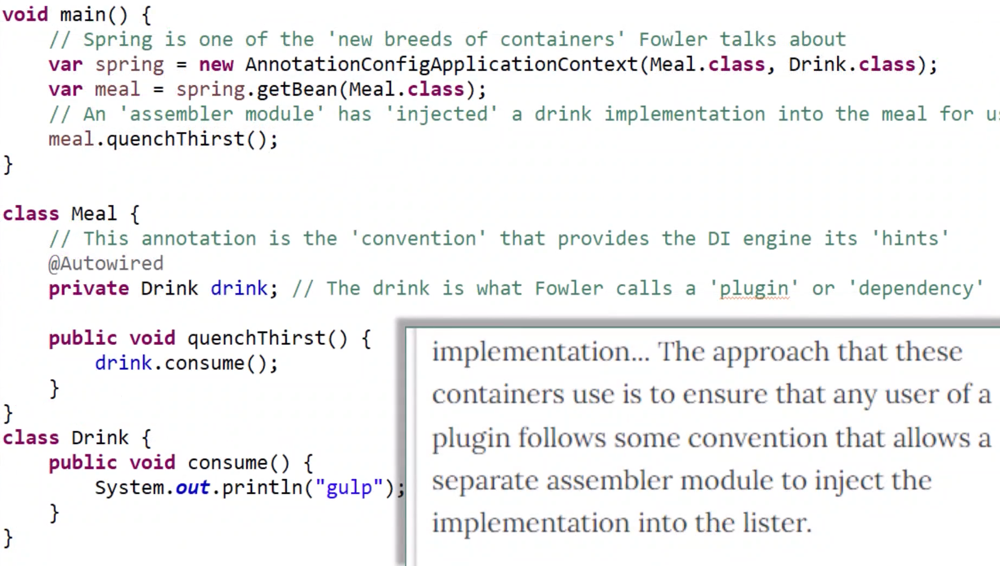

Courtesy of [Cameron McKenzie](https://www.youtube.com/watch?v=gD3TWLkHw4w)

## Inversion of control container

How traditionally objects are pulled out of inversion of control container and problems that are solved with dependency injection.

To understand dependency injection you have to understand what dependency and inversion of control container as it does the injection

**Dependency** is when one class holds a reference to another class (just an object specified as a variable inside of another class)

```java
class Meal {
  private Drink drink;

  public void quenchThirst() {
    this.drink.consume();
  }
}

class Drink {
  public void consume() {
    System.out.println("gulp");
  }
}
```

Inversion of control is a design pattern

When you got objects that have complicated life-cycles, or difficult parameterization, or interact with low level resources get that logic out and push it somewhere else and something else becomes the inversion of control. Adheres to a *Hollywood principle - Don't call us, we'll call you*. It means an IoC framework will call your application code.

Developers should keep their business logic clean by externalizing complicated and complex configuration, lifecycle management and system interactions. Complex tasks should be handled by IoC framework.

For example the Spring framework you can pass in class references. 

```java
var spring = new AnnotationConfigApplicationContext(Meal.class, Drink.class); // this says "I want to use spring as a inversion of control container and these complicated classes and I want you to manage them for me. Container will create instances of them, pass instances out when needed, parameterize them. Inversion of control containers manage the instances (in this case beans) so when you get instance of class you call the IoC container" spring container 
var drink = spring.getBean(Drink.class); // this is calling the IoC container
drink.consume(); // this is getting the handled instance
```

Now if we wanted to get the Meal we would get a `NullPointerException` as the container does not know how to handle the `Meal` **dependency** `Drink` so we have to give instructions on how to **inject** this dependency. So this is the problem the dependency injection solves, everyone loved to use Inversion of Control containers but there was no documented way of handling dependencies of classes. 

One way to address this was to use independent classes and use container created instances to construct objects. The other way would be create independent instances then create dependent and feed them independent ones through setters. But you imagine why it's convoluted. Then came the Locators. Locators are implemented inside the dependent class inside of their constructors. Basically they create the instance to fill the dependency in a loosely coupled way. The problem with it is that with locator the class has to reference the framework, in other words its a pollution of business logic with external services.

```java
class Meal {
  public Meal() {
    drink = ServiceLocator.getObject(Drink.class);
  }
  public void quenchThirst() {
    drink.consume();
  }
}
```

The incredible unobtrusive way of handling dependencies and succinct. Here's a Java Spring example:

```java
class Meal {
  @Autowired
  private Drink drink;

  public void quenchThirst() {
    drink.consume();
  }
}
```

The `@Autowired` mean that the Inversion of control container will inject the needed dependency. But how is this possible? 



Terms: Dependency injection, Loose coupling, Unobtrusive initialization