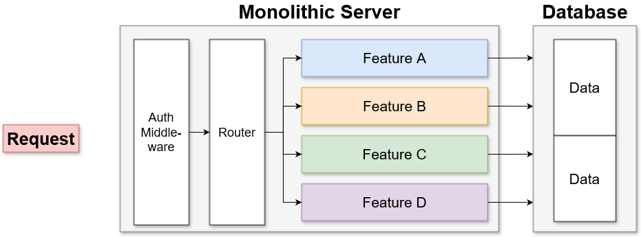
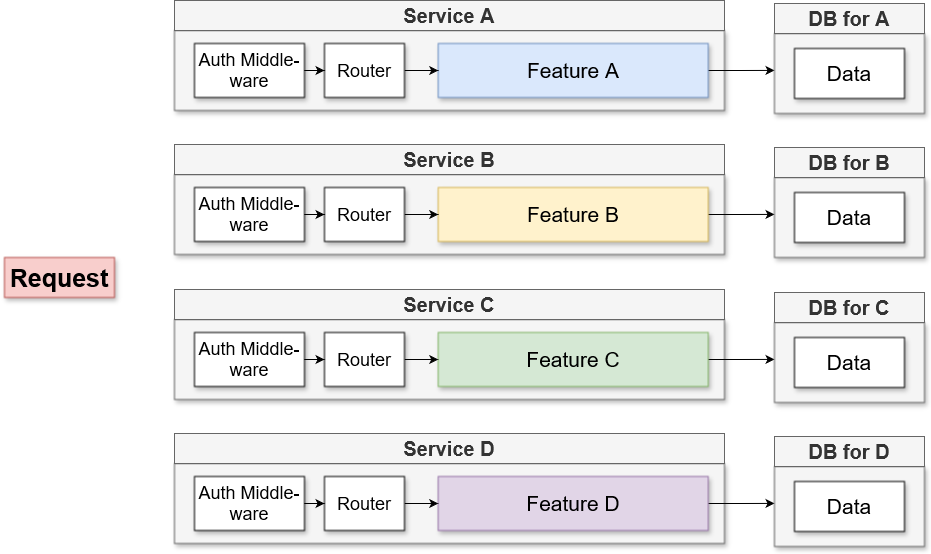
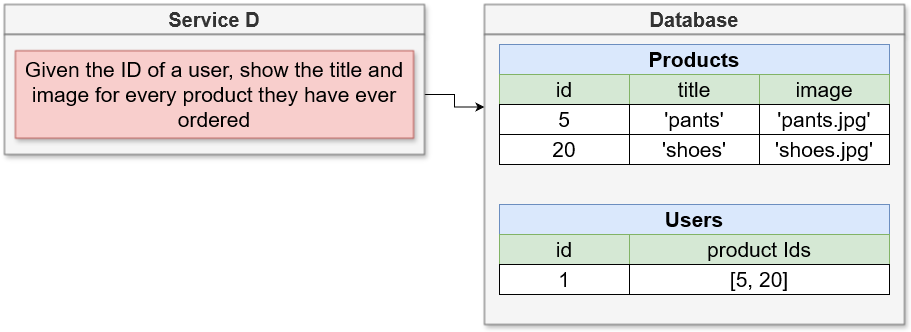
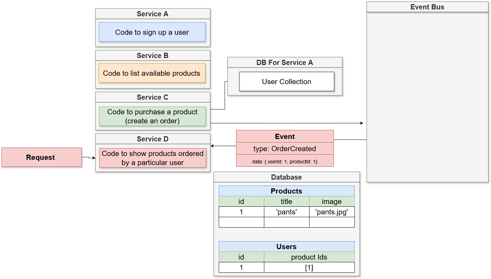

# Microservices vs Monolithic server

## What is a monolithic server?

Monolith is a type of architecture for server (could also for other types of software e.g. front-ends) that contains all of the routers, all of the middleware, all the features and data access points for an application. It goes without saying that the servers depends on a single codebase thus contains all the features of the app.

## How is microservices different from monoliths?

Microservices are individual units in a system that are responsible for a single feature. It has it's own routing, middleware, business logic, database that are facilitated to implement that one feature.

One advantage of microservices is that it's more resilient. In the case of a monolith, if it were to crash, all of the service would be unusable. But with microservices, unless all of the microservices crash, the unaffected parts can still function.

## Data management between services

The biggest problem with microservices is managing the data. We know that every service may have a database if it needs it. This pattern is called database-per-service. The monolithic architecture approach and some variations for microservices might use a single centralized database. There might be several problems with that:

1. If the database crashes, the other services will be unavailable
2. If one microservice needs more throughput it's easier to scale a specific database, than the centralized one.

## Database-per-service

Data management is the biggest problem in the microservice architectures. There are several design principles that should be considered first when trying to structure data-flow between microservices.

### Data schema changes

Microservices may be developed by different teams. If microservice A is using microservice B data, microservice must've implemented all features that satisfied the data schema of microservice B. But after some time schema for the service B has changed. Now the service A is unstable, as it may be trying to parse data of a schema that is no longer existent.

### Cross-dependant data

Different microservice should not be trying to access data directly from a database from another microservice. This creates a direct connection between them, therefore if the database is down, the microservice will not be able to access data. Having separate databases increases uptime.

### Database specific problems

Some services may perform better or make more sense with a different type (e.g. NO-SQL, SQL, etc.) database.

## E-commerce example

Let's say we had an e-commerce website where an user could sign-in and order products. If we were to use a monolith we would have single service that would implement all necessary features for each data-specific features (e.g. sign-in, view products, order products). Now let's say we needed to implement a 'show all products ordered by a particular user' feature. We would write a join query from different tables and aggregate the answers accordingly. It's pretty straightforward

Now let's go over to the microservices world. How would we structure microservices? We would have a service for each feature: user authentication, viewing products, ordering. But now we want to implement a 4th service for 'show all products ordered by a particular user'. How will we create this 4th service to extract data between services?

## Microservice communication strategies

1. Sync - services communicate between each other using direct request. Not necessarily HTTP, or a request to exchange JSON, but a direct request to fetch some data. E.g. service A will send a request to service B to retrieve some data.
2. Async - Services communicate between with each other using events.

They are not similar to JavaScript sync/async.

## Sync example

To implement a service D for 'show all products ordered by a particular user' we would make it communicate will all the services to retrieve all the necessary data to get the desired result.

1. We would check if the user exists inside the service that is responsible for user management
2. Then with the user relevant data orders data is retrieved. It contains lists of all product ids
3. With those product ids, we retrieve products from service C and we display the result somewhere.

### Pros and cons of sync communication

Pros:

- Conceptually easy to understand
- Service D won't need a database

Cons:

- Introduces dependencies between services
- If any of interservice request fails - all fails
- The whole request is only as fast as the slowest one
- introduces a web of dependencies. The other services that are directly queried by the service D might also have to send requests to other services and if any of that fails everything fails.

## Async event-based communication

Async has 2 different methods of communication.

Idea behind async is to have an event bus and it's purpose is to handle notifications from all our different services. All services are connected to the event bus and connected services may send event and receive events from event bus. We are again introducing a single point of failure so it must be resilient.

To illustrate how the event-based communication works let's take a look how our 'show all products ordered by a particular user' example would work. The service D would send an event of type UserQuery with some data (e.g. id) and the event bus would be configured to route such events to service A which is responsible for user data related queries. It would process it and then send another event of UserQueryResult which is then piped to service D that can further process and send another event to get other relevant data.

This example is not often used because shares all the downsides of sync communication and also introduces additional downsides.

### Pros and cons

Pros:

1. Conceptually harder to understand
2. Service D still does not need a database

Cons:

1. Introduces dependency between services
2. If one fails - all fails
3. The fastest request is only as fast as the slowest one
4. Web of dependencies can be easily introduced

## Second form of Async communication

To illustrate this example let's define an exact goal of service D.

Given the ID of a user, show title and image for every product they have ever ordered.

We could introduce a database, that would save user and product data required to accomplish this request.

Each time a new user signs in or a new order is made, this service is called to and data is filled with the appropriate data.

Let's go over a more detailed example.

1. Let's say our service B for handling products gets a request to create a new product. The product gets created and stores in it's respective database. But now, we need that product record in our service D, for when we request a product list for a particular user. Service B emits an event to the event bus (or event broker) of type ProductCreated with relevant data and that is sent to all interested services.
2. Service D which is responsible for our functionality gets that event and handles the event and saves the relevant data.
3. Later a user signs up to our application. Some user data is needed for service D. So the same flow as described before would repeat. An event of type UserCreated would flow to the event bus, which would be redirected to the service D to make database changes.
4. Now an order is made by the user that has registered in the previous step. Through the same flow the record would have been made in the service's D database. And now we would have all the required data to display all the orders that a particular user has made.

### Pros and cons

1. Pros
   - Service D has zero dependencies as it does need to reach out to other services to fetch data. It will also be more robust
   - Service D will be much faster because of the previous point - it does not need to get data from other services
2. Cons
   - Data duplication as similar data is stored in several places. This means more DBs and more costs. But you have to do calculations. As an example a GB of storage may cost .11$. And let's say you had a 1250 byte records inside the database. So if you were to store 100,000,000 records of that size you would pay around 15$ per month. Which for a large business may mean nothing.
   - Harder to understand
   - My cons - what if we have already existent databases with user, product and orders data - how would we introduce service D, would we write scripts to populate data?
