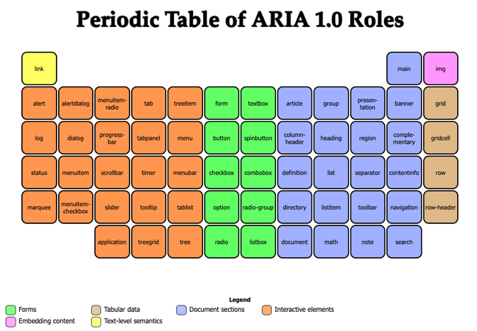

# Accessibility

## a11y (pronounced I)

Web accessibility means that web apps are designed in a way that people with special needs still can understand the web app.

Aids should be considered for these needs:

- Auditory
- Cognitive
- Neurological
- Physical
- Speech
- Visual

1 in 6 persons have some sort of impairment. People with impairment use technology to make their lives easier. This also includes people with inabilities or incapabilities which may be brief, temporary or permanent.

- Migraine headaches
- Broken arm
- Carpal tunnel in the wrist
- Colorblindness
- ADHD
- Low hearing or vision
- Stutters
- Autism
- Older people with changing abilities due to aging

Or even situational or environmental circumstances

- Bright sunlight
- Environment where people cannot listen to audio
- Slow internet connection
- Limited or expensive bandwidth
- Devices with small screens
- Parent of a newborn with constantly full arms

## Legal risks

Not confining to accessibility needs may result in legal trouble. In the USA, accessibility related lawsuits have increased more that 1658%. From 262 in 2016 to 4605 in 2023.

## Screen readers

Software applications that help people with visual impairments

- NVDA (Opensource windows)
- JAWS (License)
- VoiceOver (integrated into MacOS)
- Narrator (integrated into Windows)

### Screen reader features

- Can read by character, word, sentence, line, paragraph
- Can spell our words
- Can output speech to text

Can provide quick lists to navigate to items by:

- Type
- Headings
- Landmarks/regions
- Tables
- Links
- Interactive elements
- Etc.

## Levels A — AAA

WCAG are a set of standards for making web content accessible

WCAG 2.2 is categorized into 3 levels. A(Lowest), AA(MID), AAA(HIGHEST)

- A has access 25 criteria
- AA has additional 13
- AAA has additional 23 (61 total)

## Semantic HTML tags for improved accessibility

ARIA - accessible rich internet applications is a set of attributes to help provide additional context for content.

It provides information on the roles, properties, states, relationships and focus management.

### Rules for ARIA use

- Always use native HTML where possible, unless it's absolutely impossible then consider ARIA
- All interactive ARIA controls must be keyboard accessible
- For all elements that are focusable never use role='presentation' or aria-hidden='true' as it then will focus on nothing, causing confusion.
- All interactive elements must have an accessible name

### ARIA roles

Give semantic meaning to elements, which provides context for the user on what the element will be and how to interact with it.

ARIA elements are generally used to describe elements

- That do not exist in the HTML
- Elements which may not have cross-browser support
- Elements which may have implementation gaps with screen readers



### ARIA states

States that can be applied to the elements. They are likely to change as the user interacts with the page.

They are usually inserted into an element

```html
<element aria-state="value"></element>
```

### ARIA properties 

Properties are applied to elements. They stay static instead of being dynamic like states

## General tips

1. Decorative images should have an empty `alt` attribute
2. To make another `option` the default value for `select` element, the `defaultValue` attribute should be used to reference `option` element's value.
3. Wrap radio input in a `fieldset` tag and and a `legend` tag on top. Then the `input` and `label` can be wrapped in a `div`
4. In React use `htmlFor` instead of `for` attribute for binding label with `input`'s id.  

## Links

- [Aria guide](https://www.lullabot.com/articles/what-heck-aria-beginners-guide-aria-accessibility)
- [WCAG 2 A and AA checklist](https://usability.yale.edu/web-accessibility/articles/wcag2-checklist)
- [ARIA patterns](https://www.w3.org/WAI/ARIA/apg/patterns/)
- [ARIA 101](https://a11y-101.com/)
- [w3 grouping](https://www.w3.org/WAI/tutorials/forms/grouping/)
