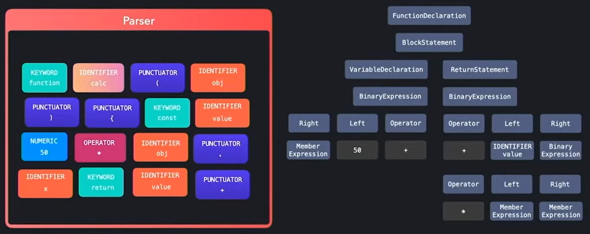
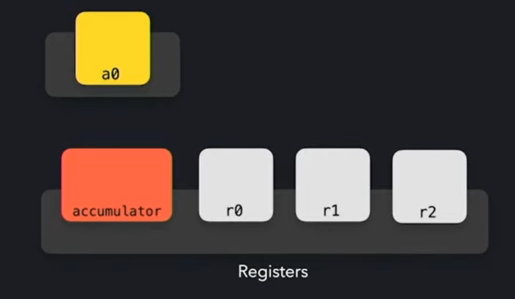

Notes on JavaScript engines where taken referencing [this video](https://www.youtube.com/watch?v=xckH5s3UuX4)

# High-level JavaScript overview 

JavaScript is a dynamically interpreted language, that means it parses code at runtime, interprets it, and does functions.

It may parse variables that don't exist or work with object of unknown shape. But we won't know until event loop reaches the point of error (or syntax error). 

Runtimes that run JavaScript interpreters are called engines. More popular engines are 

- V8 used by Chromium-based browsers, NodeJS (since it was made from chromium open-source)
- SpiderMonkey developed by Mozilla 

Further in this article, different JavaScript processes will be described, with the aim to explain how JavaScript works on a higher level.

## Script loading 

HTML parser goes over the HTML file and when it detects a `<script>` tag with JavaScript referenced as a source through `src` attribute, the parsers tries to retrieve from either: 

- Network
- Cache
- Service worker

The bytes for the file are returned, which are then sent to the **byte stream decoder**.

## Byte stream decoding

Inside the byte stream decoder bytes get decoded and tokens are created based on recognizable structures. It will create tokens for:

- Keywords (function, async/await, static, return)
- Identifier (variable names)
- Punctuator (brackets)
- Operators (arithmetic operators)
- Values (numeric, text, bool)

And while all of these are being `tokenized`, the decoded tokens are being sent to the parser.

Then nodes are created based on whether a token matches a syntax rule in JavaScript to form a syntax tree. Examples are:

- `FunctionDeclaration` node
- `BlockStatement` 
- `VariableDeclaration`
- `BinaryExpression`
- and so on

All these syntax nodes are used to form a syntax tree, which can be followed to form a logical sequence of operations and definitions for how to execute code.



Also while parsing the tokens, syntax errors are being checked. So if none of the syntax rules are matched, then we get an error.

## Parser

```
In node we can enable print byte code flag, to receive generated byte code  
```

Before passing bytecode to the parser, bytecode is passed to the optimizer.

The generated syntax tree gets sent into a **ignition parser**, with bytecode generator syntax tree gets parsed and from that byte code is generated. Decoded byte code looks similar to machine code.

Byte code then gets executed by the parser. Registers are used to store intermediary data, inputs/outputs.



- r0, r1, r2
- accumulator used for byte code input/output
- a0 used for values passed to the function

`a0` generates a **shape object**, to make it possible for byte code to identify passed values/objects. Shape objects or hidden class or a map, are structures that defined for passed arguments.

Shape objects are useful because they are used for an optimization - **inline cache**. Inline cache stores results of previous byte code operations, so the next time the exact some operation is called we first check inline cache to see if we have already cached the result already to avoid repeated calculation 

## TurboFan optimizer 

Generates actual machine for functions that are hot, meaning called many times during the interpreters lifetime. Inline cache generates feedback for the optimizer. Feedback's main purpose to resolve what data types we are working with? As operations for numeric `+` operation differs from a text, so feedback helps address that for optimizer to generate appropriate code. 

So feedback and bytecode is used to generate machine code, that is much faster to execute, because it directly runs on the CPU.

To determine whether to optimize with TurboFan or not passed shape is checked. If it the structure is exactly the some through multiple function calls, machine code is generated and then it is used. But if a different shape is detect, the interpreter deoptimizes back to the generated bytecode. 

Best case for the optimizer is that bytecode is monomorphic, then it means the object will always be invoked with the same object shape. If not, the code is polymorphic. Also functions may be megamorphic.